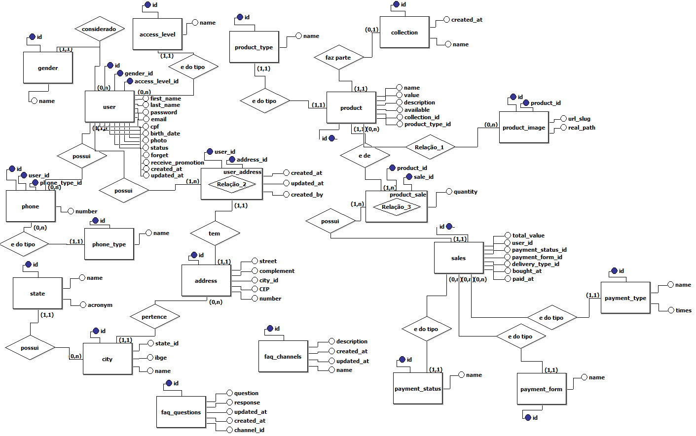

<p align="center"></p>

#

Welcome to the Redstore microservice based, a simple implementation with docker containers

#### How to setup the DEV environment:

```shell
$ cp .env.example .env && vi .env
```

```shell
$ ./Reverse-Proxy/gen-ssl.sh
```

```shell
$ docker-compose build && docker-compose up -d
```

```shell
$ docker container exec redstore-api composer install && \
  docker container exec redstore-web composer install
```

To setup the PROD environment use -f docker-compose.production.yml in two commands

#

## Architecture:

<p align="center"></p>

#

## Database schema:

<p align="center"></p>

### Accessing database: 
```
$ docker container exec -it redstore-database mysql -u root -p"simple-server" -D "redstore"
```

#

## Short example of API endpoints

> Base URL: https://REDSTORE_IP/api

<!--- > Detailed endpoints <a href="">Here</a> -->

* GET /products
* GET /products/{page}/{limit}
* GET /products/{page}/{limit}/{order}/{direction}
* GET /product/{id}
* POST /product
* POST /product-image/{id}
* PATCH /product
* DELETE /product-image/{id}

Getting data with Curl
```shell
$ curl -ks -X GET https://REDSTORE_IP/api/product/1 | jq .
```
Output
```json
{
  "message": {
    "id": 1,
    "name": "example product",
    "value": 20,
    "description": "example product",
    "available": 1,
    "rate": 0,
    "collection_id": null,
    "category": {
      "id": 8,
      "name": "Others"
    },
    "ProductImage": []
  }
}
```

#

## Frontend features

> Add and exclude new products and there images

<p align="center"></p>

<p align="center"></p>
